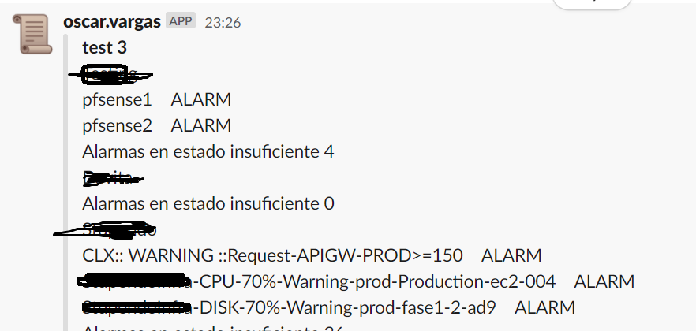

# cw_report_multi-account
_Si tienes multiples cuentas de #AWS y quieres mirar que esta alarmado sin tener que abrir la consola cuenta por cuenta por cuenta y se hacemas tedioso cuando se ingresa por SSO y/o se tiene MFA por temas de seguridad_

## Comenzando 🚀

_Estas instrucciones te permitirán optimizar tiempo y generar un reporte envia a algun canal de #slack._

### Pre-requisitos 📋

_aws cli version 2, como minimo 2 cuentas, un canal de Slack al cual enviar el reporte (opcional)_

```
aws --version
```

_debes nombrar los perfiles de las cuentas con los numeros_

```
aws configure --profile 1
```
_asi debe lucir tu archivos de credentials que encontras en tu carpeta $path/.AWS_

```
[1]
aws_access_key_id = dsgsf.......sdsf
aws_secret_access_key = sdfsg.........sdfdsfsd
[2]
aws_access_key_id = dsgsf.......sdsf
aws_secret_access_key = sdfsg.........sdfdsfsd
[3]
aws_access_key_id = dsgsf.......sdsf
aws_secret_access_key = sdfsg.........sdfdsfsd
```

_Webhook que apuente a algun canal de Slack_

```
https://hooks.slack.com/services/SDHGFDFGH/AESTTHGGFSAD/aetsfhgfsdrtfyh (es un enlace falso)
```

### Instalación 🔧

_Paso a Paso de como realizar este reporte_

_descargamos el repositorio_

```
git clone https://github.com/oscar93varlop/cw_report_multi-account.git
```
_ingrese a la carpeta_

```
cd cw_report_multi-account/
```

_damos permisos de ejecucion a los archivos sh_

```
chmod +x *.sh
```

_debes modificar el archico  automation_cw.sh en la linea 2, por la cantidad de cuentas a revisar_

```
for ((num=1; num<=3; num++ ))
```

_debes modificar el archico  automation_cw.sh en la linea 6 y agregar el nombre de la cuenta en cada case que coincida con el numero de los profile de aws_

```
case $num in
		1)
			sed -i '1i Prod' $num.txt
			;;
		2)
		  sed -i '1i Dev' $num.txt
			;;
		3)
			sed -i '1i qa' $num.txt
			;;
		esac 
```

_debes modificar el archico  automation_cw.sh en la linea 28, y agregar el webhook, el canal al cual se va a subir el reporte / usuario que quieres que aparezca en el mensaje  /  emoji de slack / nombre del archivo / titulo del reporte_

```
sh msg_to_slack.sh -h https://hooks.slack.com/services/bbbbbbbb/aaaaaaa/wsryhrtdgsdfyghf -c nombre del canal -u user.example -i scroll -F rutina.txt -T "report"
```
_Finaliza con un mensaje donde listara el nombre de las alarmas en estado **ALARM** y la cantidad de alarmas en estado **INSUFFICIENT_DATA**_

```
sh automation_cw.sh
```


## Ejecutando las pruebas ⚙️

_Aqui un ejemplo con tres cuentas de tres diferentes empresas_




### Automatizar ?🔩

_para mas automatizacion puedes colocar este sh ejecutarlo en un cron job para que cada cierto tiempo se ejecute_

```
0 */1 * * * $home/cw_report_multi-account/automation_cq.sh 
```

## Autores ✒️

**Oscar Vargas SysOps AWS**

* Comenta a otros sobre este proyecto 📢
* Invita una cerveza 🍺 o un café ☕ a el autor del tutorial. 

---
⌨️ con ❤️ por [Oscar Vargas](https://github.com/oscar93varlop) 😊
